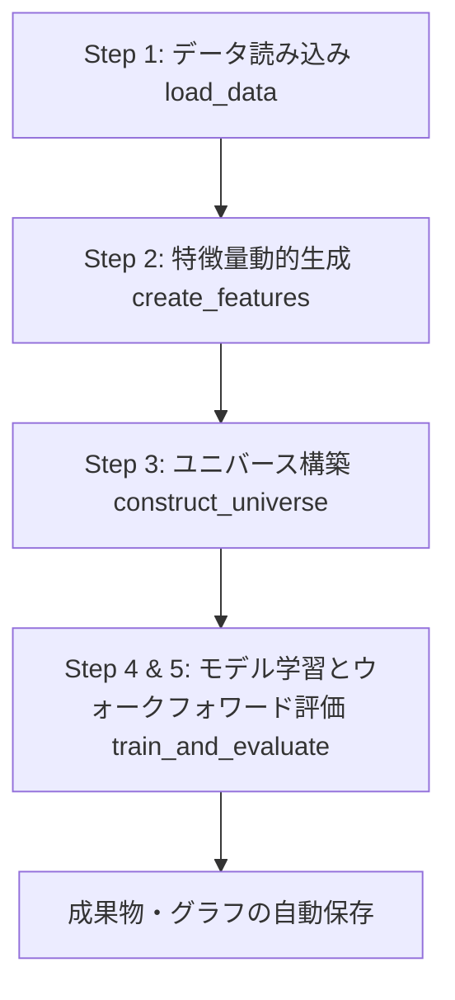

# モメンタム投資戦略ベースラインモデル構築・検証スクリプト（`src/momentum_model.py`）仕様・解説書

このドキュメントは、ゴールデンクロス（GC）を起点としたモメンタム投資戦略の予測モデルを構築・検証するスクリプト [`src/momentum_model.py`](file:///Users/hiranotakahiro/Projects/銘柄スクリーニング検証/src/momentum_model.py) の目的、データ構造、特徴量エンジニアリング、学習パイプライン、および出力結果の仕様を解説したものです。

---

## 1. 目的と概要

### 1.1 背景と目的
株式市場において、短期移動平均線が長期移動平均線を上抜ける「ゴールデンクロス（GC）」は代表的な買戻し・トレンド発生シグナルですが、ダマシ（すぐに反落する偽シグナル）も多く存在します。

本スクリプトの目的は、**GCが発生した後のモメンタム期間（GCからデッドクロス（DC）までの期間）において、将来のリターンが上位20%に入るような「本物のモメンタム銘柄」を機械学習（LightGBM分類モデル）を用いて高精度に予測すること**です。

### 1.2 主な特徴
- **自動動的特徴量生成**: 移動平均の傾き、出来高比率、GCからの経過日数（初動の捉えやすさ）、テーマ（`Core_Product_Tech`）別平均モメンタムなどを動的に計算。
- **データリークの厳格な防止**: ウォークフォワード検証時、テスト期間開始日時点でDCを迎えていない（未来のDC価格が判明していない）訓練サンプルを除外。
- **二値分類タスク化**: 目的変数を「GC～DC間リターンの上位20%か否か（`1` or `0`）」に二値化し、クラス不均衡に対応した重み付け（`class_weight='balanced'`）で学習。
- **SHAP分析と自動成果物保存**: 各実行ごとにタイムスタンプ付きのディレクトリを生成し、評価ログ・モデルファイル・特徴量重要度グラフ・SHAP Summary Plot を一括保存。

---

## 2. 入力データ仕様

### 2.1 データソース
計算には以下の2つのデータソースを使用します。

1. **日足株価データベース (`data/stock_data.db` の `daily_prices` テーブル)**
   - `code`: 銘柄コード (文字列)
   - `date`: 取引日 (`YYYYMMDD` 形式)
   - `open`, `high`, `low`, `close`, `volume`: 始値、高値、安値、終値、出来高
   - ※ データベース内に存在する `'-'` などの非数値文字列は、自動的に `NaN` へ変換され、前後の有効値や `0` で自動補完されます。

2. **銘柄マスター辞書 (`data/ticker_dictionary.json`)**
   - 各銘柄の属性・カテゴリ情報を含むJSON配列。
   - `code`: 銘柄コード
   - `industry`: 業種分類名
   - `layered_tags.Core_Product_Tech`: 銘柄が属する技術・製品テーマタグ群

---

## 3. 分析パイプラインの構成

スクリプト実行時の全体パイプラインは以下のステップで進行します。



### 【Step 1: データ読み込み (`load_data`)】
- SQLiteデータベースから `daily_prices` を全件取得し、日付型変換およびインデックス設定（`['code', 'date']`）を行います。
- `ticker_dictionary.json` を読み込み、`industry`（業種）および `core_product_tech`（代表テーマタグ）を平坦化して抽出・結合用DataFrameを生成します。

### 【Step 2: 特徴量動的生成 (`create_features`)】
銘柄（`code`）ごとに以下のテクニカル・テーマ特徴量を動的に算出します。

| 特徴量名 | 計算式・定義 | 投資的意味・目的 |
| :--- | :--- | :--- |
| `ma5_slope` | 5日移動平均線の前日比変化率 ($MA5_t / MA5_{t-1} - 1$) | 短期的な価格勢い |
| `ma25_slope` | 25日移動平均線の前日比変化率 ($MA25_t / MA25_{t-1} - 1$) | 中期的なトレンド角度 |
| `vol_ratio` | 当日出来高 / 20日移動平均出来高 | 出来高の急増（大口資金流入）の検知 |
| `vol_ratio_5d` | 5日移動平均出来高 / 20日移動平均出来高 | 出来高の継続的な増加傾向 |
| `industry` | 銘柄の属する業種（カテゴリカル変数） | 業種ごとのボラティリティや基準値の相違の補正 |
| `theme_ma5_slope_avg` | 同一テーマタグ（`Core_Product_Tech`）に属する銘柄の平均 `ma5_slope` | テーマ全体の買われ具合（バスケット買いの検知） |
| `theme_vol_ratio_avg` | 同一テーマタグに属する銘柄の平均 `vol_ratio` | テーマ全体の出来高盛り上がり度 |

### 【Step 3: ユニバースの構築とターゲット計算 (`construct_universe`)】
1. **GC判定**: 5日移動平均線が25日移動平均線を上回っている日（`is_gc = 5MA > 25MA`）を特定。
2. **DC（デッドクロス）情報の補完**: ベクトル化処理により、各GC日における「将来初めて訪れるDC日の日付（`dc_date`）と終値（`dc_price`）」を特定。
3. **経過日数（`days_since_gc`）の計算**: GCが発生してから何日目であるかを計算。初動銘柄を捉えるための重要な指標。
4. **ターゲットスコアの計算**:
   $$\text{target\_score} = \frac{\text{DC日終値} - \text{当日終値}}{\text{当日終値}}$$
   ※ ターゲットスコアは外れ値対策として `[-0.5, 2.0]` の範囲にクリッピングされます。

### 【Step 4 & 5: モデル学習とウォークフォワード評価 (`train_and_evaluate`)】
1. **時系列クロスバリデーション (`TimeSeriesSplit`)**: データを日付順にソートし、時間軸に沿った3つのFold（分割）を作成。
2. **データリーク防止フィルター**:
   $$\text{valid\_train\_mask} = (\text{train\_df['dc\_date']} < \text{test\_start\_date})$$
   学習データのサンプルであっても、そのサンプルがターゲット計算に使用している「将来のDC日」がテスト期間に跨がっている場合、未来のデータリークとなるため学習から除外。
3. **分類ラベリング**:
   - 学習データ・テストデータそれぞれの内部で `target_score` の上位20%パーセンタイルを算出し、上位20%に該当するサンプルを `1`（正例）、それ以外を `0`（負例）と定義。
4. **LightGBM Classifier の学習**:
   - `LGBMClassifier(n_estimators=100, learning_rate=0.05, class_weight='balanced')`
5. **モデル予測とリターン評価**:
   - テストデータに対して予測確率（`pred_proba`）を算出。
   - 予測確率上位20%の銘柄群を選択し、その平均 `target_score`（**Model Return**）を計算。
   - テスト期間全サンプルの平均 `target_score`（**Baseline Return** = ランダム選択）と比較し、超過収益（**優位性** = `Model Return - Baseline Return`）を評価。

---

## 4. 出力成果物と出力例

スクリプト実行時、実行時点のタイムスタンプが付与されたディレクトリが自動生成されます。
- **標準出力先**: `data/exports/<YYYYMMDD_HHMMSS>_momentum_model_outputs/`

### 4.1 成果物一覧

| ファイル名 | 概要・内容 |
| :--- | :--- |
| `evaluation_log.txt` | 各Foldのデータ件数、しきい値、Foldごとのリターン、最終平均優位性、特徴量重要度ランキングのテキストログ |
| `feature_importance.png` | LightGBMモデルの特徴量重要度（Feature Importance）の横棒グラフ |
| `shap_summary_plot.png` | テストデータに対する SHAP 値の Summary Plot（特徴量が予測に与える影響の方向性と強さの可視化） |
| `momentum_model_baseline.txt` | 学習済み LightGBM ブースターモデルファイル（推論・実運用への組み込み用） |

### 4.2 実行結果の例 (`data/models/20260719_baseline/` の場合)

以下は、任意保存例（`data/models/20260719_baseline`）に含まれる評価結果ログの例です。

```text
Fold 1:
  - Train=194035行, Top20_Threshold=0.0047, PositiveRate=20.00%
  - Test=217577行, Top20_Threshold=0.1006
  - 選択された銘柄数=43516行
  - Baseline Return: 0.0450, Model Return: 0.0467
Fold 2:
  - Train=347124行, Top20_Threshold=0.0131, PositiveRate=20.00%
  - Test=217577行, Top20_Threshold=0.0538
  - 選択された銘柄数=43516行
  - Baseline Return: 0.0205, Model Return: 0.0276
Fold 3:
  - Train=589703行, Top20_Threshold=0.0361, PositiveRate=20.00%
  - Test=217577行, Top20_Threshold=0.0108
  - 選択された銘柄数=43516行
  - Baseline Return: -0.0105, Model Return: 0.0018
--------------------------------------------------
【最終評価結果】
ランダム選択リターン (Baseline): 0.0184
モデル選択リターン (Model)   : 0.0254
優位性 (Model - Baseline)  : 0.0070
--------------------------------------------------
【特徴量重要度 (Feature Importance)】
1. industry: 1457.00
2. days_since_gc: 382.33
3. ma25_slope: 343.00
4. ma5_slope: 241.00
5. theme_ma5_slope_avg: 200.00
6. theme_vol_ratio_avg: 162.67
7. vol_ratio_5d: 143.33
8. vol_ratio: 70.67
```

- **モデルの優位性**: ランダム選択の平均リターン `1.84%` に対し、モデル選択銘柄群は `2.54%` と、**+0.70% (+0.0070) のアルファ（超過リターン）**を獲得しています。
- **特徴量の傾向**: `industry`（業種）が圧倒的に重要度が高く、次いで `days_since_gc`（初動の早さ）や `ma25_slope`（中長期の傾き）が貢献していることが分かります。

---

## 5. 実行方法

プロジェクトのルートディレクトリで仮想環境を有効にし、以下のコマンドを実行します。

```bash
# 仮想環境の有効化（未有効の場合）
source .venv/bin/activate

# スクリプトの実行
python src/momentum_model.py
```

実行が完了すると、コンソールにプログレスおよび結果サマリーが表示され、`data/exports/` 配下に新しい出力ディレクトリが作成されます。
